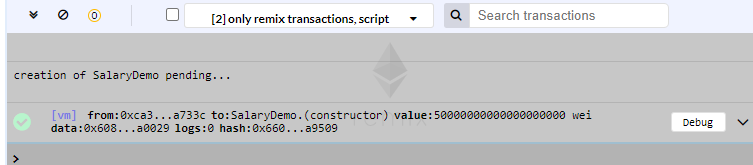

# Salary Distribution Demonstration

This demonstration is based on solidity programming, blockchain and smart contracts. Here we are trying to implement a pragmatic solution to the problem of distributing salary to respective employees of the company and also present the actual transfer of the salary. 

## Tools used for this project
* Remix IDE
* Metamask

## Implementation Details
To implement the salary distribution demonstration in blockchain, we need to have an environment to develop the blockchain code. We use Remix for this purpose. To do the transaction in blockchain we need to make use of __smart contracts__ which contain the business logic. This is deployed to the blockchain.

We define the smart contract named __SalaryDemo__ in Remix IDE with the __contract__ keyword
``` solidity
contract SalaryDemo {
  //Business logic here
} 
```

We’ll define the state variables in the contract

``` solidity
address payable owner; 
//Address of owner
    
uint salary;
//Salary of each employee
    
address payable[] employee;
//Array of addresses of employees
    
mapping (address  => uint) eSalary;
//Map structure to map address of employee to his/her salary
  
event LogDeposit(uint hello, address accountAddress) ;
//Event to show the salary and address of the employee in the console
    
event strr(string mess);
//To show some message in the console
```

Let’s define the constructor which sets the owner account when we deploy the contract to the blockchain
```solidity
//__public__ meaning it’s accessible outside the contract
constructor() public payable {
    owner = msg.sender;
}
```

We are using a __modifier__, which adds a constraint on certain methods used below so that only the owner is able to invoke it

```solidity
modifier onlyOwner {
  require(msg.sender == owner);
  //Condition checking is done and throws error if it fails
  _;
}
```

Next, we have methods. Let’s take them one by one.

### getOwner
This method returns the account address of the owner, here it returns the address of the manager.

```solidity
function getOwner() public view returns(address) {
   return owner;
}

```

### setSalary
This method sets the salary of each employee by the manager

```solidity
function setSalary(address payable addr, uint amount) public onlyOwner {
  employee.push(addr);
  //Push the employee address into the array

  eSalary[addr] = amount;
  //Set the corresponding salary
}

```
Here __onlyOwner__ modifier ensures that only the owner(manager) can invoke this method


### getSalary
This method logs the salary of each employee and also finds total salary and logs it to console

```solidity
function getSalary() payable public{
  uint sum = 0;
  for(uint i=0; i<employee.length; i++) {
    sum += eSalary[employee[i]];
    emit LogDeposit(eSalary[employee[i]], employee[i]);   
  }
  emit strr("sum is");
  emit LogDeposit(sum, msg.sender);
}

```

### payout
This method actually sends the salaries given by the manager to their accounts

```solidity
function payout() public payable {
  for(uint i=0; i<employee.length; i++) {
    employee[i].transfer(convertToWei(eSalary[employee[i]]));
    }
}
```

__transfer__  function send the ether to __employee[i]__

### convertToWei
Converts __ether__ to __wei__ as by default __transfer__ function takes units in __wei__
(1 Ether = 10<sup>18</sup>wei)
```solidity
function convertToWei(uint amount) private pure returns(uint) {
  return amount * 1000000000000000000;    
  //1 Ether = 1000000000000000000 Wei 
}

``` 

## Screenshots

>__Javascript VM where contract was deployed with 5 ethers which is shown as 5000000000000000000 wei__


<br><br>

>__Owner address__


<br><br>
>__Setting the account and salary for employee in setSalary box in the image and ether__


<br><br>

>__getSalary output(in javascript VM)__ 


<br><br>

>__Metamask transaction details after sending 2 and 3 ethers to two employees__


